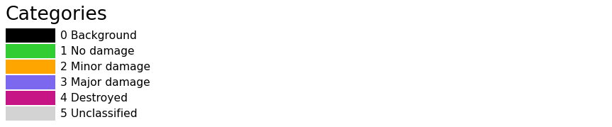
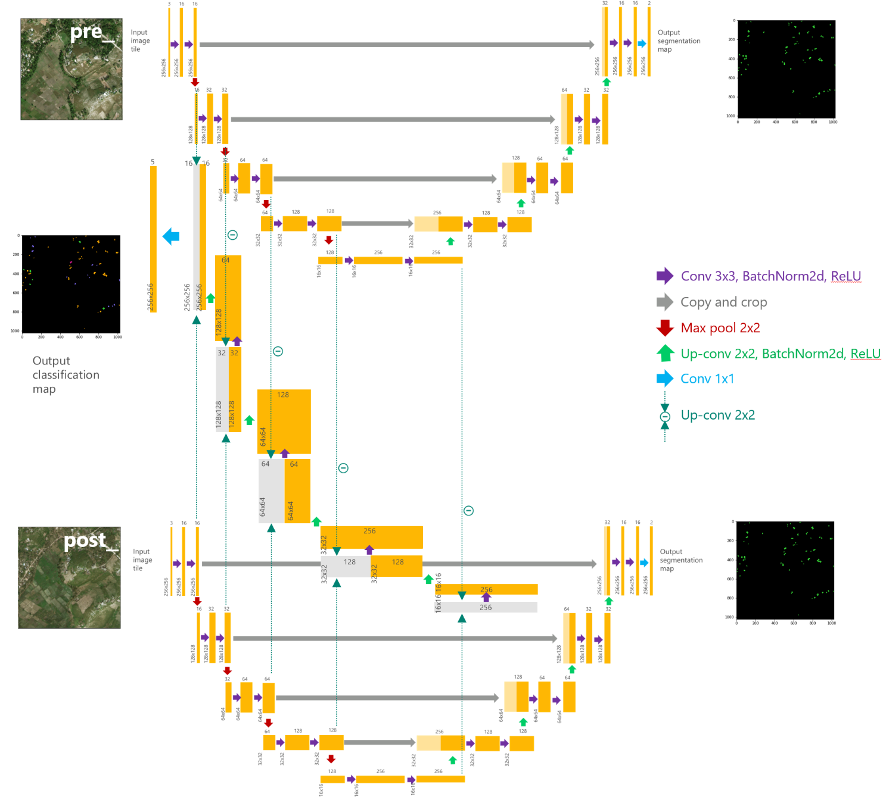
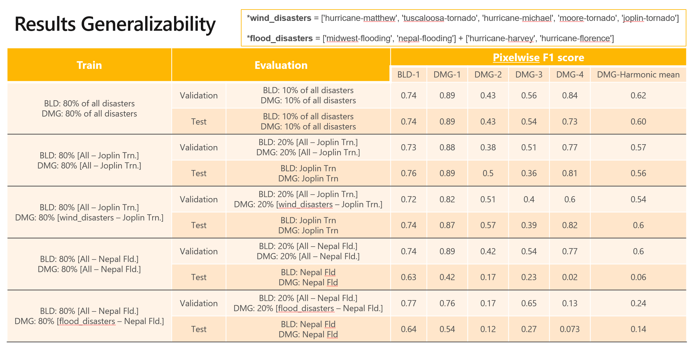
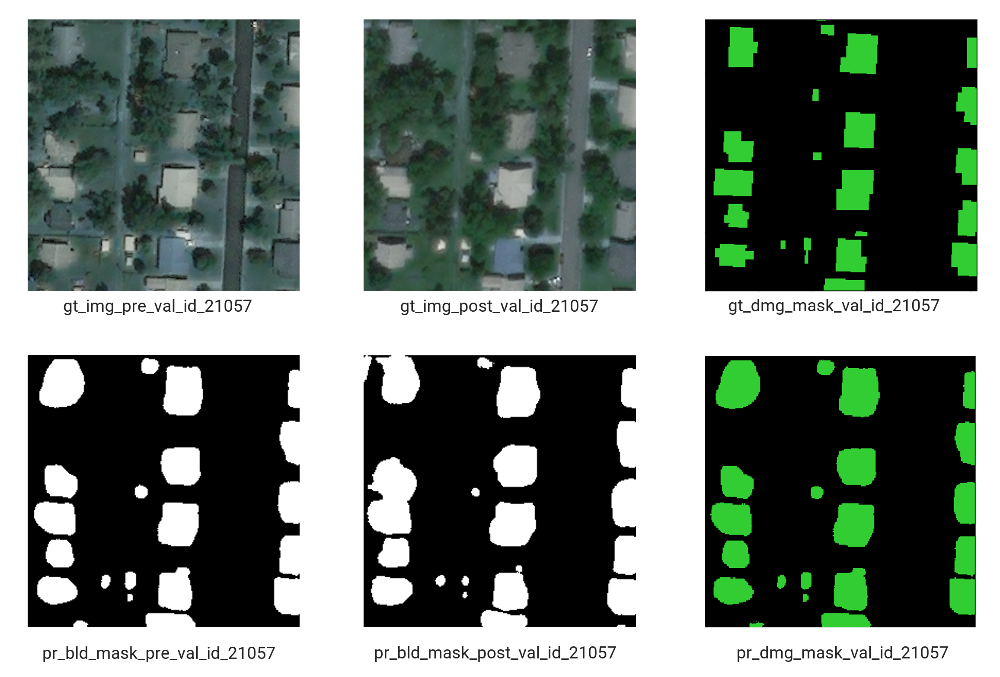
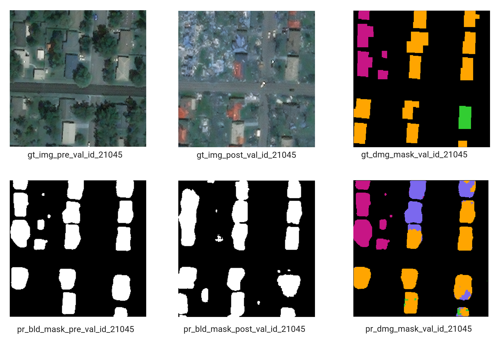

# Copyright (c) Microsoft Corporation. All rights reserved.
# Licensed under the MIT License.

# Building Damage Assessment Model

**Jump to: [Data sources](#data-sources) | [Setup](#setup) | [Data processing](#data-processing) | [Data splits & augmentation](#data-splits-&-augmentation)| [Overview of the model](#overview-of-the-model) | [Running experiments](#running-experiments) | [Results](#results) |**


Natural disasters affect 350 million people each year. Allocating resources such as shelter, medical aid, and food would relieve people of pain most effectively if the impact of the disaster could be assessed in a short time frame after the disaster. The Netherlands Red Cross (NLRC) founded the [510](https://www.510.global/) initiative in 2016 to turn data into timely information and put it in the hands of aid workers. This study was a Microsoft AI for Humanitarian Action project in collaboration with the NLRC 510 global initiative. In this study, we leverage high-resolution satellite imagery to conduct building footprint segmentation and train a classifier to assign each building's damage severity level via an end-to-end deep learning pipeline. Knowing the damage to individual buildings will enable calculating accurately the number of shelters or most impacted areas by natural disasters required in large-scale disaster incidents such as a hurricane.

## Data Sources
We used [xBD dataset](https://xview2.org/), a publicly available dataset, to train and evaluate our proposed network performance. Detailed information about this dataset is provided in ["xBD: A Dataset for Assessing Building Damage from Satellite Imagery"](https://arxiv.org/abs/1911.09296) by Ritwik Gupta et al.

## Dependencies

### Docker

This code uses Docker to allow portability, the only dependency is docker itself, you can get docker from [here] (https://docs.docker.com/get-docker/).

After you have installed, you will just need to run the build command from the root of this project (in the example bellow we add a -t tag, you can use whatever tag you want), same level as the dockerfile is:

```
docker build . -t nlrc-building-damage-assessment:latest 
```

After the image is build, run the inference code by using below command, passing the parameters with the correspoding values. Use nvidia-docker for using GPUS.

```
docker run --name "nlrc-model" --rm  -v /datadrive/nlrc:/mnt nlrc-building-damage-assessment:latest "--output_dir" "/mnt" "--data_img_dir" "/mnt/dataset" "--data_inference_dict" "/mnt/constants/splits/all_disaster_splits_sliced_img_augmented_20.json" "--data_mean_stddev" "/mnt/constants/splits/all_disaster_mean_stddev_tiles_0_1.json" "--label_map_json" "/mnt/constants/class_lists/xBD_label_map.json" "--model" "/mnt/models/model_best.pth.tar"
```

## Setup

### Creating the conda environment

At the root directory of this repo, use environment.yml to create a conda virtual environment called `nlrc`:

```
conda env create --file environment.yml
```

If you need additional packages, add them in environment.yml and update the environment:
```
conda env update --name nlrc --file environment.yml --prune
```

### Installing `ai4eutils`

We make use of the `geospatial` module in the [ai4eutils](https://github.com/microsoft/ai4eutils) repo for some of the data processing steps, so you may need to clone it and add its path to the `PYTHONPATH`:

```
export PYTHONPATH="${PYTHONPATH}:/path/to/ai4eutils"
```

## Data processing

### Generate masks from polygons

We generate pixel masks based on the xBD dataset labels provided as polygons in geoJSON files since the tier3 disasters did not come with masks and the masks for the other disasters had a border value that was likely 0, which would not help to separate the buildings. To do that, we modified the xView baseline repo's [script](https://github.com/DIUx-xView/xView2_baseline/blob/master/utils/mask_polygons.py) for [create_label_masks.py](./data/inspect_masks.ipynb) to generate the masks for entire dataset. Commands that we ran:
```
python data/create_label_masks.py ./nlrc-damage-assessment/public_datasets/xBD/raw/hold -b 1

python data/create_label_masks.py ./nlrc-damage-assessment/public_datasets/xBD/raw/test -b 1

python data/create_label_masks.py ./nlrc-damage-assessment/public_datasets/xBD/raw/train -b 1

python data/create_label_masks.py ./nlrc-damage-assessment/public_datasets/xBD/raw_tier3 -b 1

python data/create_label_masks.py ./nlrc-damage-assessment/public_datasets/xBD/raw/hold -b 2

python data/create_label_masks.py ./nlrc-damage-assessment/public_datasets/xBD/raw/test -b 2

python data/create_label_masks.py ./nlrc-damage-assessment/public_datasets/xBD/raw/train -b 2

python data/create_label_masks.py ./nlrc-damage-assessment/public_datasets/xBD/raw_tier3 -b 2

```
Masks for border widths of 1 and 2 were created in case we would like to experiment with both cases. We used a border of 2 but you can see their effects in the notebook [inspect_masks.ipynb](./data/inspect_masks.ipynb) and choose either case that you would prefer.


### Generate smaller image patches
To create smaller patches from xBD original tiles you can use this code: [make_smaller_tiles.py](./data/make_smaller_tiles.py). In the experiments, we cropped 1024x1024 images into 256x256 patches.  In this document, we refer to each original 1024x1024 xBD image as a "tile" and any image of smaller size cropped from the original tile is referred to as a "patch".

```
python data/make_smaller_tiles.py
```

### Generate npy files
Given the size of the dataset, loading the images one by one from the blob storage is very time-consuming. To resolve this low-speed issue, we loaded the entire dataset once and saved them as one npy file. Then for the experimnets, we loaded the data upfront, which helped with speed-up significantly.

To do that you can use this code: [make_data_shards.py](./data/make_data_shards.py).
We saved the entire xBD dataset into one shard but if more shards are required due to the large size of the data, the same code can be used for that purpose as well.

```
python ./data/make_data_shards.py
```

### Data normalization
Normalization for each patch is conducted based on its corresponding tile's mean and standard deviation. To compute mean & standard deviation for each tile, [data/compute_mean_stddev.ipynb](./data/compute_mean_stddev.ipynb) in the `data` dir of this repo can be used a reference.
sample of a file that contains tile-based mean & standard deviation for xBD dataset: [constants/splits/all_disaster_mean_stddev_tiles_0_1.json](./constants/splits/all_disaster_mean_stddev_tiles_0_1.json)

### Constants

The xBD output classes and their numerical class used in the label polygon/masks are documented on the xView2_baseline [repo](https://github.com/DIUx-xView/xView2_baseline/tree/821d9f8b9201ee7952aef13b073c9fd38ce11d4b#output):

```
0 for no building 
1 for building found and classified no-damaged 
2 for building found and classified minor-damage 
3 for building found and classified major-damage
4 for building found and classified destroyed
```

We have an extra class, `5`, to denote building features that were "unclassified" in xBD. They need to be discounted during training and evaluation.


[constants/class_lists](./constants/class_lists/) contains files with information about mapping between actual damage category, class labels and color codes used for predicted classes vizulaization.


## Data splits & augmentation

To make the split, [data/class_distribution_and_splits.ipynb](./data/class_distribution_and_splits.ipynb) in the `data` dir of this repo can be used a reference.

We do not use the train/test/hold splits that xBD used during the xView2 competition. We retain the folder structure of the datasets (which has train/test/hold as folder names). This JSON is a dictionary where the key is the name of the disaster, and the value is another dict with keys `train`, `val` and `test`, each pointing to a list of file paths, starting from the xBD root directory in the data storage container.

Files with information about dataset splits and their corresponding paths along with the mean and standard deviation for each image tile used for normalization are placed in [constants/splits](./constants/splits/) in this repo. All the splits used in our training are randomized based on the xBD 1024x1024 tiles before being cropped into smaller patches.

Sample of a file that contains xBD 1024x1024 image paths for train/val/test sets split at ratio 80:10:10 can be found via [constants/splits/all_disaster_splits.json](./constants/splits/all_disaster_splits.json)

Sample of a file that contains xBD 256x256 image paths for train/val/test sets split at ratio 80:10:10 where each 1024x1024 xBD tile has been cropped into 20 patches (16 non-overlapping and 4 overlapping patches) can be found via [constants/splits/all_disaster_splits_sliced_img_augmented_20.json](./constants/splits/all_disaster_splits_sliced_img_augmented_20.json)

Sample of a file that contains xBD 1024x1024 image paths for train/val/test sets split at ratio 90:10:0 can be found via [constants/splits/final_mdl_all_disaster_splits.json](./constants/splits/final_mdl_all_disaster_splits.json)

Sample of a file that contains xBD 256x256 image paths for for train/val/test sets split at ratio 90:10:0 where each 1024x1024 xBD tile has been cropped into 20 patches (16 non-overlapping and 4 overlapping): [constants/splits/final_mdl_all_disaster_splits_sliced_img_augmented_20.json](./constants/splits/final_mdl_all_disaster_splits_sliced_img_augmented_20.json)

Note: In our sample split jsons, '/labels/' is part of the string for each image paths. Please note that this component of the string is being replaced with appropriate strings to reflect the correct folder structure in xBD dataset when loading pre- and  post-disaster images and their labels masks during training and inference.

As explined above, for our experiments, we used the augmented splits where each 1024x1024 xBD tile has been cropped into 20 patches (16 non-overlapping and 4 overlapping patches). Moreover, during the training, we conduct random vertical and horizontal flipping on-the-fly as implementd in [train/utils/dataset_shard_load.py](./train/utils/dataset_shard_load.py).


## Overview of the model

Our proposed approach shares some characteristics with ["An Attention-Based System for Damage Assessment Using Satellite Imagery"](https://arxiv.org/pdf/2004.06643v1.pdf) by Hanxiang Hao et al. However, we do not incorporate any attention mechanism in the network and we use a fewer number of convolutional layers for the segmentation arm, which is a UNet approach. Details of our architecture are shown below:


<!-- 
<p align="center">
    
</p> -->

Our proposed model, implemented in this repo, is an end-to-end model, which provides building masks on a pair of pre- & post-disaster satellite imagery along with the level of damage for each detected building, in case of natural disasters.

## Running experiments

### Training 
The model needs to be trained sequentially for building detection and damage classification tasks. The loss function has three components for penalizing mistakes on three different predicted outputs of the network that include: (I) building detection on pre-disaster imagery, (II) building detection on post-disaster imagery, and (III) the damage classification output. We use a Siamese approach where for segmentation tasks (I) & (II), the UNet network parameters are shared (shown in the upper and lower arm of the network in the Network Architecture Schema). UNet embeddings of pre- and post-disaster imagery, generated from the encoder part of the model, are differenced and run through several convolutional layers to give the final pixel-wise classification of the damage level for predicted buildings via the middle arm shown in Network Architecture Schema.

To train the network for building detection task, we first avoid penalizing the network for mistakes in the damage classification task by setting the weight for that task equal to 0 (e.g., in config dictionary, set `'weights_loss': [0.5, 0.5, 0] & 'mode': 'bld'`). In this model, if a checkpoint path is provided, the model resumes training based on that, otherwise, it starts training from scratch. 
Once model training progresses and reasonable results are achieved for building detection, the training can be stopped and the damage classification task can get started via freezing the parameters of the building segmentation task (e.g., in config dictionary, set `'weights_loss': [0, 0, 1] & 'mode': 'dmg'`). The checkpoint for the best epoch tuned for building segmentation tasks should be provided in the config dictionary to allow proper damage classification results. Please review the config dictionary in [train/train.py](./train/train.py) before running the code.

```
python train/train.py
```

The experiment's progress can be monitored via tensorboard.

```
tensorboard --host 0.0.0.0 --logdir ./outputs/experiment_name/logs/ --port 8009
```

### Inference
The trained model can be used for inference via the following command. The best trained model file is presented under [models](./models/model_best.pth.tar) directory. Please review the paramters needed in [inference/inference.py](./inference/inference.py) before running the code.

```
python inference/inference.py --output_dir outputs/ --data_img_dir xBD_sliced_augmented_20_alldisasters/ --data_inference_dict constants/splits/all_disaster_splits_sliced_img_augmented_20.json --data_mean_stddev constants/splits/all_disaster_mean_stddev_tiles_0_1.json --label_map_json constants/class_lists/xBD_label_map.json --model models/model_best.pth.tar
```
Samples of files that contain input images paths are shown in [constants/splits/final_mdl_all_disaster_splits_sliced_img_augmented_20.json](./constants/splits/final_mdl_all_disaster_splits_sliced_img_augmented_20.json) and [constants/splits/all_disaster_splits_sliced_img_augmented_20.json](./constants/splits/all_disaster_splits_sliced_img_augmented_20.json). 
This input file can contain one or multiple image paths for inference.


### Evaluation
During the development phase, our main evaluation metric was pixel based evaluation for both tasks, i.e., building segmentation and damage classification. However, building-level evaluation utilities are also provided in [eval](./eval) folder for your reference. We have incorporated the building-level evaluation metric into the inference code as well. The evaluation results are saved as CSV files. However, please note that the building predicted polygons might be connected in some patches and calculated true positive numbers are extremenly underestimated. Thus, we believe that pixel-level evaluation is a better metric that reflect more fairly on the performace of the model in damaged area detection.

## Results
We show the results on validation and test sets of our splits along with some segmenation maps with damage level.



